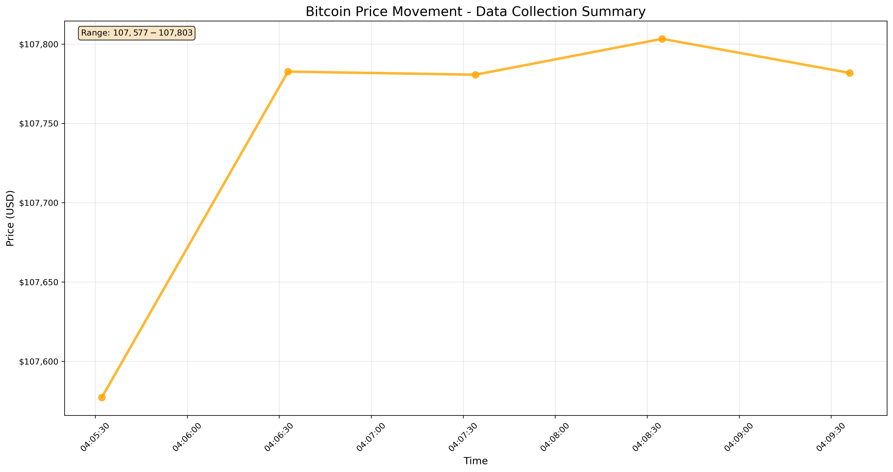

#  Real-Time Cryptocurrency Price Analysis and Visualization Pipeline

## 📋 Project Overview

This project implements a comprehensive real-time cryptocurrency data collection and analysis pipeline using Python. It fetches live cryptocurrency prices from the CoinMarketCap API, processes the data with pandas, and creates interactive visualizations to track price movements and trends.

##  Results Visualization

The project generates real-time Bitcoin price charts like the one below:



##  Key Features

###  Real-Time Data Collection
- **Live API Integration**: Connects to CoinMarketCap Pro API for real-time cryptocurrency data
- **Automated Data Fetching**: Collects data at customizable intervals (1-5 minutes)
- **Multi-Currency Support**: Tracks top 15 cryptocurrencies including Bitcoin, Ethereum, and more
- **Dual Storage**: Automatically saves data to both local CSV files and network drives

###  Advanced Analytics
- **Price Movement Tracking**: Real-time monitoring of price changes with percentage calculations
- **Historical Trend Analysis**: Analyzes 1h, 24h, 7d, 30d, 60d, and 90d percentage changes
- **Statistical Aggregation**: Groups and summarizes data by cryptocurrency for trend identification

###  Interactive Visualizations
- **Live Price Charts**: Real-time line plots showing Bitcoin price movements
- **Multi-Timeframe Analysis**: Categorical plots for comparing percentage changes across different time periods
- **Custom Chart Updates**: Automatic chart generation during data collection cycles
- **Professional Styling**: Uses Seaborn's darkgrid theme for polished visualizations

###  Quick Collection Mode
- **5-Minute Collection**: Rapid data gathering for immediate analysis
- **1-Minute Intervals**: High-frequency sampling for detailed price tracking
- **Live Progress Tracking**: Real-time updates showing collection progress and price changes
- **Automatic Chart Generation**: Charts update every 3 data points during collection

##  Technologies Used

### Core Libraries
- **pandas**: Data manipulation and analysis
- **requests**: HTTP requests for API communication
- **matplotlib**: Basic plotting functionality
- **seaborn**: Advanced statistical visualizations
- **json**: API response parsing

### APIs
- **CoinMarketCap Pro API**: Professional cryptocurrency data service

##  Getting Started

### Prerequisites
```python
pip install pandas requests matplotlib seaborn jupyter
```

### API Setup
1. Get a free API key from [CoinMarketCap Pro API](https://pro.coinmarketcap.com/api/v1)
2. Replace the API key in the headers configuration

### Quick Start
1. **Initialize the Environment**: Run cells 1-5 to set up imports and functions
2. **Import Visualization Libraries**: Execute cell 20 for plotting capabilities
3. **Load Quick Collection Function**: Run cell 24 to define the collection function
4. **Start Data Collection**: Execute cell 25 to begin real-time collection

##  Usage Examples

### Basic Data Collection
```python
# Collect Bitcoin data for 5 minutes at 1-minute intervals
quick_bitcoin_collection()
```

### Extended Collection
```python
# Collect data for 10 minutes at 2-minute intervals
quick_bitcoin_collection(duration_minutes=10, interval_minutes=2)

# Collect data for 30 minutes at 5-minute intervals
quick_bitcoin_collection(duration_minutes=30, interval_minutes=5)
```

### Data Analysis
```python
# Load and analyze collected data
df_csv = pd.read_csv('crypto_data.csv')
bitcoin_data = df_csv[df_csv['name'] == 'Bitcoin']

# Generate price visualization
sns.lineplot(x='timestamp', y='quote.USD.price', data=bitcoin_data)
```

##  Project Structure

```
 Real-Time Cryptocurrency Price Analysis and Visualization Pipeline.ipynb
 crypto_data.csv                 # Local data storage
 M:\Data\Automating-Crypto-Website-API\API.csv  # Network backup
 README.md                       # This documentation
```

##  Sample Output

### Live Collection Progress
```
 Quick Bitcoin Collection Starting!
 Every 1 minutes for 5 minutes
 Will collect 5 data points
 Finishing at: 04:10:31

 Collection 1/5 at 04:05:31
 Bitcoin: $107,577.26
 Total Bitcoin records: 1

 Collection 2/5 at 04:06:32
 Bitcoin: $107,782.64
 Total Bitcoin records: 2
 Change: $+205.38 (+0.191%)
```

### Final Results
- **Price Range**: $107,577 - $107,803
- **Total Records**: 75 cryptocurrency entries
- **Bitcoin Data Points**: 5 time-series records
- **Visualizations**: 2 charts (intermediate + final)

##  Contributing

1. Fork the repository
2. Create a feature branch (`git checkout -b feature/AmazingFeature`)
3. Commit your changes (`git commit -m 'Add some AmazingFeature'`)
4. Push to the branch (`git push origin feature/AmazingFeature`)
5. Open a Pull Request

##  License

This project is licensed under the MIT License - see the LICENSE file for details.

##  Acknowledgments

- **CoinMarketCap**: For providing comprehensive cryptocurrency API data
- **Pandas Development Team**: For powerful data manipulation tools
- **Matplotlib/Seaborn**: For excellent visualization capabilities
- **Jupyter Project**: For interactive development environment
